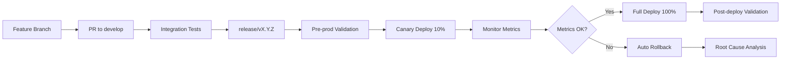

# GUÍA DE GOBERNANZA DE CICLO DE VIDA POST-DESPLIEGUE

**Generado por**: Prompt Pasivo D - Guía de Gobernanza  
**Fecha**: {{ timestamp }}  
**Objetivo**: Definir cómo el sistema **evoluciona, se mantiene y se depreca** sin romper contratos

## 1. PRINCIPIOS DE EVOLUCIÓN 📈

### 1.1 Contratos Externos son Sagrados
**Regla de Oro**: Endpoints, esquemas de respuesta, formatos de webhook **NO CAMBIAN sin versión**

#### Contratos Críticos Identificados:
| Contrato | Tipo | Ejemplo | Versión actual |
|----------|------|---------|----------------|
| API REST | HTTP | `GET /api/v1/tasks` → `List[Tarea]` | v1 |
| WebSocket | WS | `EventType.TASK_CREATED` → `WSMessage` | v1 |
| Telegram Bot | Bot | `/crear_tarea <desc>` → confirmation | v1 |
| Webhook Callbacks | HTTP | `POST /webhook` → Telegram format | v1 |

#### Proceso de Cambio de Contrato:
1. **Análisis de impacto**: ¿Qué clientes se romperían?
2. **Versionado**: Nueva versión (ej: `/api/v2/tasks`)
3. **Deprecation notice**: Header `Deprecation: true` + documentación
4. **Período de gracia**: Mínimo 90 días calendario
5. **Retirement**: Solo después de confirmación de migración

### 1.2 Deprecación Explícita Obligatoria
Cualquier cambio breaking debe cumplir **TODOS** estos requisitos:

#### Checklist de Deprecación:
- [ ] **Header HTTP**: `Deprecation: true` en respuestas del endpoint
- [ ] **Header Sunset**: `Sunset: Wed, 11 Nov 2024 23:59:59 GMT`
- [ ] **Documentación**: Entrada en `CHANGELOG.md` con fecha y alternativa
- [ ] **Notificación**: Email/mensaje a todos los usuarios registrados
- [ ] **Período mínimo**: 90 días entre anuncio y desactivación
- [ ] **Monitoreo**: Métricas de uso del endpoint deprecated

#### Template de Entrada en CHANGELOG.md:
```markdown
## [DEPRECATED] v1.2.0 - 2024-01-15
### DEPRECATED
- `GET /api/v1/tasks/legacy` - Use `GET /api/v2/tasks` instead
  - **Sunset date**: 2024-04-15
  - **Breaking changes**: Response format changed from Array to Object
  - **Migration guide**: See docs/migration/v1-to-v2.md
```

## 2. MONITOREO CONTINUO 📊

### 2.1 Métricas Obligatorias (SLIs)

#### Rendimiento
- **Latencia p95 por endpoint**: < 1000ms
- **Latencia p99 por endpoint**: < 2000ms
- **Throughput**: requests/second por endpoint

#### Confiabilidad  
- **Error rate 5xx**: < 1% por período de 5 minutos
- **Error rate 4xx**: < 5% por período de 5 minutos
- **Uptime**: > 99.5% mensual

#### Específicas de GRUPO_GAD
- **Telegram API quota usage**: % de límite diario usado
- **PostGIS query time**: percentil 95 < 100ms
- **WebSocket connections**: activas concurrentes
- **Task assignment latency**: tiempo desde creación hasta asignación < 30s

### 2.2 Alertas (SLOs)

#### Críticas (PagerDuty)
```yaml
alerts:
  - name: "API Latency Critical"
    condition: "p95_latency > 1000ms for 5 minutes"
    action: "Page on-call engineer"
    
  - name: "Error Rate High" 
    condition: "5xx_errors > 1% for 5 minutes"
    action: "Page on-call engineer"
    
  - name: "Telegram Quota Critical"
    condition: "telegram_quota_usage > 80%"
    action: "Alert dev team + reduce bot activity"
```

#### Warnings (Slack)
```yaml
warnings:
  - name: "PostGIS Slow Queries"
    condition: "postgis_p95_latency > 100ms for 10 minutes"
    action: "Slack #dev-alerts"
    
  - name: "WebSocket Disconnections"
    condition: "ws_disconnection_rate > 10% for 5 minutes"  
    action: "Slack #dev-alerts"
```

### 2.3 Dashboards de Monitoreo

#### Dashboard Ejecutivo (Business Metrics)
- Total de tareas creadas/hora
- Tiempo promedio de resolución  
- Efectivos activos por región
- Users activos en Telegram bot

#### Dashboard Técnico (SRE Metrics)
- Request latency distribution
- Error rates por endpoint
- Database connection pool utilization
- WebSocket connection health

#### Dashboard de Capacidad
- CPU/Memory usage por servicio
- Database storage growth rate
- Network bandwidth utilization
- Projected capacity exhaustion dates

## 3. PROCESO DE RELEASE 🚀

### 3.1 Branching Strategy
```
main (production-ready)
├── release/v1.2.0 (pre-production validation)
├── develop (integration)
└── feature/emergency-endpoint (development)
```

### 3.2 Release Pipeline


### 3.3 Validación Pre-Despliegue Automática
**Script obligatorio**: `scripts/validate_pre_deploy.sh`

```bash
#!/bin/bash
# Ejecuta CHECKLIST_VERIFICACION.md automáticamente
# Exit code 0 = OK to deploy, 1 = Block deployment

set -e

echo "🔍 Validating GRUPO_GAD pre-deployment..."

# Level 1: Infrastructure
docker compose exec db psql -c "SELECT PostGIS_version();" > /dev/null || exit 1
docker compose exec redis redis-cli PING | grep PONG > /dev/null || exit 1

# Level 2: Configuration  
[ $(find . -name "settings.py" | wc -l) -eq 1 ] || exit 1
git grep -q "CHANGEME\|sk-\|bot:[0-9]" && exit 1 || true

# Level 3: Critical functionality
curl -f http://localhost:8000/api/v1/health > /dev/null || exit 1
curl -f http://localhost:8000/metrics > /dev/null || exit 1

# Level 4: Performance baselines
latency=$(curl -w "%{time_total}" -s -o /dev/null http://localhost:8000/api/v1/health)
[ $(echo "$latency < 1.0" | bc) -eq 1 ] || exit 1

echo "✅ All validation checks passed - READY TO DEPLOY"
exit 0
```

### 3.4 Canary Deployment Strategy

#### Phase 1: Canary 10% (5 minutes)
- Route 10% of traffic to new version
- Monitor error rates and latency
- Auto-rollback if metrics degrade > 50%

#### Phase 2: Canary 50% (10 minutes)  
- Route 50% of traffic if Phase 1 successful
- Continue monitoring business and technical metrics
- Manual approval gate for Phase 3

#### Phase 3: Full Deploy 100%
- Route 100% traffic to new version
- Keep old version running for 1 hour (quick rollback)
- Post-deployment validation

### 3.5 Rollback Automático
```bash
# Triggered automatically if:
# - Error rate > 5% for 5 consecutive minutes
# - p95 latency > 2x baseline for 5 minutes  
# - Critical alert fired during deployment window

# Rollback process:
1. Route 100% traffic back to previous version
2. Page on-call engineer  
3. Create incident in PagerDuty
4. Preserve logs/metrics for analysis
5. Block further deployments until RCA complete
```

## 4. SEÑALES DE OBSOLESCENCIA ⚠️

### 4.1 Indicadores Técnicos
- **Dependencias sin soporte**: Python < 3.12, FastAPI < 0.100
- **Security vulnerabilities**: CVE críticos sin parche disponible  
- **Performance degradation**: Metrics consistentemente peores que baselines
- **Maintenance burden**: > 50% tiempo dev en bug fixes vs features

### 4.2 Indicadores de Negocio
- **Costo de mantenimiento > valor generado**: ROI negativo por 2 trimestres
- **User engagement decline**: < 10% de users activos vs peak
- **Regulatory changes**: Nuevas regulaciones requieren re-arquitectura completa

### 4.3 Indicadores de Evolución Tecnológica
- **Paradigm shift**: Aparición de paradigma superior (ej: AI agents → autonomous systems)
- **Platform obsolescence**: Telegram/PostgreSQL deprecated  
- **Team knowledge loss**: < 2 personas conocen codebase completo

## 5. PLAN DE DESCONTINUACIÓN 🔚

### 5.1 Proceso de Sunset (180 días)

#### Día 0: Anuncio Oficial
- [ ] Email a todos los usuarios registrados
- [ ] Update en Telegram bot con fecha de cierre
- [ ] Banner en dashboard web
- [ ] Entrada prominente en `README.md`

#### Día 30: Feature Freeze
- [ ] No new features, solo bug fixes críticos
- [ ] Finalizar documentación de migración/export
- [ ] Comunicar alternativas disponibles a usuarios

#### Día 90: Data Export Disponible  
- [ ] UI para exportar datos personales (JSON/CSV)
- [ ] API endpoint: `GET /api/v1/export/user/{id}` 
- [ ] Backup completo de DB para archivo

#### Día 150: Read-Only Mode
- [ ] Disable creación de nuevas tareas
- [ ] Disable nuevos registros de usuarios
- [ ] Solo consultas y exports permitidos

#### Día 180: Shutdown Final
- [ ] Stop all services
- [ ] Final data export para archivo histórico
- [ ] DNS records updated to farewell page

### 5.2 Archivado del Repositorio

#### Archivo `FINAL_STATE.md`:
```markdown
# GRUPO_GAD - FINAL STATE DOCUMENTATION

**Shutdown Date**: 2024-06-15  
**Final Version**: v2.1.4  
**Total Users**: 1,247  
**Total Tasks Processed**: 15,392  
**Uptime**: 99.7% over 18 months

## Architecture at Shutdown
- FastAPI 0.118.0 + Python 3.12
- PostgreSQL 15 + PostGIS 3.4  
- Telegram Bot API v7.0
- Docker Compose deployment

## Data Preservation
- Final database backup: `final_backup_2024-06-15.sql.gz`
- User exports: Available until 2024-12-15
- Code archive: Tagged as `final-release`

## Lessons Learned
1. PostGIS geographic assignment worked well
2. WebSocket real-time updates were valuable  
3. Telegram integration was user-friendly
4. Configuration management could be improved

## Alternative Systems
- Recommended migration: [Sistema XYZ]
- Data compatibility: Full export available
- Contact: admin@grupo-gad.example.com
```

#### Repository Actions:
- [ ] Archive repository (read-only)
- [ ] Tag final release: `git tag final-release`
- [ ] Update README with shutdown notice
- [ ] Preserve all git history
- [ ] Transfer ownership to archive organization if needed

## 6. MÉTRICAS DE ÉXITO DEL CICLO DE VIDA

### Durante Operación
- **MTTR (Mean Time To Recovery)**: < 30 minutos
- **MTBF (Mean Time Between Failures)**: > 30 días
- **Feature delivery velocity**: >= 2 releases/month
- **User satisfaction**: > 4.0/5.0 en surveys trimestrales

### Durante Evolución
- **API versioning compliance**: 100% contratos respetan período deprecación
- **Zero-downtime deployments**: > 95% de releases
- **Rollback success rate**: 100% cuando se activa
- **Security response time**: CVE críticos parcheados en < 48h

### Durante Sunset
- **User notification reach**: > 90% usuarios informados
- **Data export completion**: 100% usuarios que lo soliciten  
- **Migration success**: > 80% usuarios migrados a alternativa
- **Archive integrity**: 100% código y datos preservados

---

**Esta guía define el framework de gobernanza para toda la vida útil del sistema GRUPO_GAD**  
**Debe ser revisada trimestralmente y actualizada según evolución del proyecto**  
**Todos los cambios a esta guía requieren aprobación del equipo técnico y stakeholders**