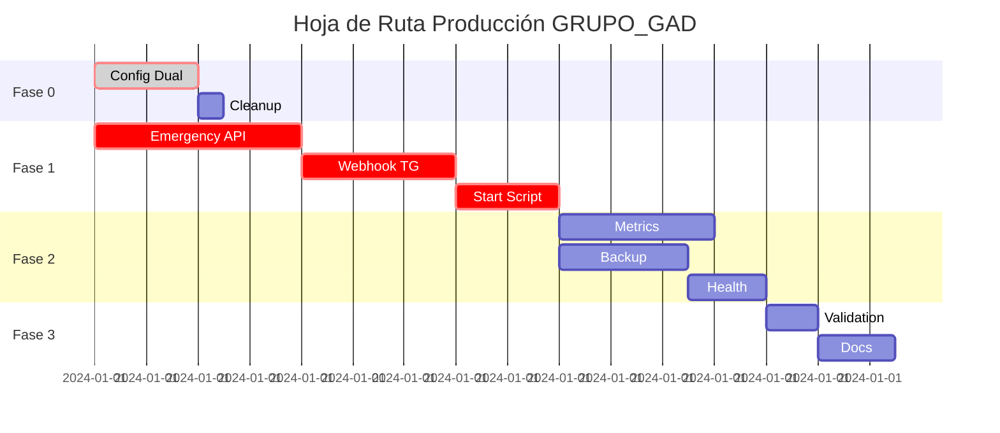

# HOJA DE RUTA ESTRATÉGICA HACIA PRODUCCIÓN

**Generado por**: Prompt Pasivo C - Hoja de Ruta Estratégica  
**Fecha**: {{ timestamp }}  
**Base**: Solo se incluyen tareas que **cierran brechas reales**, con criterio de aceptación objetivo

## FASE 0: ESTABILIZACIÓN DE CONFIGURACIÓN 🔧

### Tarea 0.1: Unificar sistema de configuración
**Gap identificado**: Configuración dual en `config/settings.py` vs `src/app/core/config.py`  
**Criterio de aceptación**: `src/bot` y `src/api` usan únicamente `config/settings.py`  
**Verificación**:
```bash
grep -r "from config.settings\|import.*settings" src/ | wc -l  # Debe ser > 0
grep -r "from src.app.core.config\|core.config" src/ | wc -l   # Debe ser 0
```
**Estimación**: 2 horas  
**Prioridad**: CRÍTICA

### Tarea 0.2: Limpiar artifacts de configuración
**Gap identificado**: `.env.production` puede existir en el repositorio  
**Criterio de aceptación**: Solo existe `docs/env/.env.production.example`  
**Verificación**:
```bash
git ls-files | grep "\.env\.production$" | wc -l  # Debe ser 0
ls docs/env/.env.production.example               # Debe existir
```
**Estimación**: 30 minutos  
**Prioridad**: MEDIA

## FASE 1: CIERRE DE BRECHAS FUNCIONALES CRÍTICAS 🚨

### Tarea 1.1: Implementar endpoint de emergencia
**Gap identificado**: No existe `/api/v1/emergency` para asignación inmediata  
**Criterio de aceptación**: Endpoint usa `ST_Distance`, `geography(Point, 4326)`, índice GiST  
**Verificación**:
```bash
curl -X POST http://localhost:8000/api/v1/emergency -d '{"lat":40.7128,"lng":-74.0060,"description":"Emergency"}'
# Debe retornar 201 con efectivo asignado en < 200ms
EXPLAIN ANALYZE SELECT ... # Debe mostrar uso de índice GiST
```
**Estimación**: 4 horas  
**Prioridad**: CRÍTICA

### Tarea 1.2: Configurar webhook Telegram para producción
**Gap identificado**: Bot solo funciona en polling, no escalable  
**Criterio de aceptación**: Bot llama `set_webhook` al iniciar en `ENVIRONMENT=production`  
**Verificación**:
```bash
grep -r "set_webhook" src/bot/ | head -1  # Debe existir
# Logs deben mostrar: "Webhook set to https://..."
```
**Estimación**: 3 horas  
**Prioridad**: CRÍTICA

### Tarea 1.3: Crear script de inicio automático
**Gap identificado**: No hay `scripts/start.sh` para orquestar inicio  
**Criterio de aceptación**: Script ejecuta migraciones antes de levantar app  
**Verificación**:
```bash
ls scripts/start.sh                           # Debe existir
bash scripts/start.sh --dry-run               # Debe mostrar secuencia
grep "alembic upgrade head" scripts/start.sh  # Debe existir línea
```
**Estimación**: 2 horas  
**Prioridad**: CRÍTICA

## FASE 2: ENDURECIMIENTO OPERATIVO 📊

### Tarea 2.1: Ampliar métricas técnicas en `/metrics`
**Gap identificado**: Métricas básicas, faltan específicas de rendimiento  
**Criterio de aceptación**: Expone latencia por endpoint, errores 5xx, tiempo de query DB  
**Verificación**:
```bash
curl -s http://localhost:8000/metrics | grep -c "request_latency_seconds"  # > 0
curl -s http://localhost:8000/metrics | grep -c "http_requests_total"      # > 0  
curl -s http://localhost:8000/metrics | grep -c "db_query_duration"        # > 0
```
**Estimación**: 3 horas  
**Prioridad**: ALTA

### Tarea 2.2: Implementar backup automático versionado
**Gap identificado**: Datos críticos sin respaldo automático  
**Criterio de aceptación**: `scripts/backup_db.sh` en repo, con ejemplo de cron  
**Verificación**:
```bash
ls scripts/backup_db.sh              # Debe existir
bash scripts/backup_db.sh --test     # Debe crear backup de prueba
ls docs/ops/cron.example             # Debe tener ejemplo de crontab
```
**Estimación**: 2.5 horas  
**Prioridad**: ALTA

### Tarea 2.3: Validar healthchecks comprensivos
**Gap identificado**: `/health` no verifica todos los componentes críticos  
**Criterio de aceptación**: Healthcheck valida DB, Redis, WebSocketManager  
**Verificación**:
```bash
curl -s http://localhost:8000/api/v1/health | jq '.components | keys'
# Debe incluir: ["database", "redis", "websockets"]
```
**Estimación**: 1.5 horas  
**Prioridad**: MEDIA

## FASE 3: VALIDACIÓN FINAL ✅

### Tarea 3.1: Ejecutar checklist de verificación completo
**Gap identificado**: No hay proceso formal de validación pre-despliegue  
**Criterio de aceptación**: Todos los ítems en `CHECKLIST_VERIFICACION.md` = OK  
**Verificación**:
```bash
bash scripts/validate_pre_deploy.sh  # Debe retornar exit code 0
# Output debe mostrar: "✅ TODOS LOS CHECKS PASSED - APTO PARA DESPLIEGUE"
```
**Estimación**: 1 hora (crear script)  
**Prioridad**: CRÍTICA

### Tarea 3.2: Documentar proceso de despliegue
**Gap identificado**: No hay runbook detallado de despliegue  
**Criterio de aceptación**: `docs/deploy/RUNBOOK.md` con pasos copy-paste  
**Verificación**: Documento existe y cubre rollback plan  
**Estimación**: 1.5 horas  
**Prioridad**: MEDIA

## CRONOGRAMA Y DEPENDENCIES



## ESTIMACIÓN TOTAL

| Fase | Tareas | Tiempo estimado | Prioridad |
|------|--------|-----------------|-----------|
| **Fase 0** | 2 | 2.5 horas | CRÍTICA |
| **Fase 1** | 3 | 9 horas | CRÍTICA |
| **Fase 2** | 3 | 7 horas | ALTA-MEDIA |
| **Fase 3** | 2 | 2.5 horas | CRÍTICA-MEDIA |
| **TOTAL** | **10** | **21 horas** | — |

## CRITERIOS DE PASO ENTRE FASES

### Fase 0 → Fase 1
- [ ] Un solo `settings.py` usado en todo el proyecto
- [ ] No hay archivos `.env.production` en git

### Fase 1 → Fase 2  
- [ ] Endpoint `/emergency` funcionando con PostGIS
- [ ] Webhook Telegram configurado para producción
- [ ] Script `start.sh` ejecuta migraciones automáticamente

### Fase 2 → Fase 3
- [ ] Métricas completas expuestas en `/metrics`
- [ ] Sistema de backup automático funcionando
- [ ] Healthchecks validan todos los componentes

### Fase 3 → DESPLIEGUE
- [ ] Checklist de verificación 100% verde
- [ ] Runbook de despliegue documentado y validado

## RIESGOS Y MITIGACIONES

| Riesgo | Probabilidad | Impacto | Mitigación |
|--------|-------------|---------|------------|
| PostGIS no funciona en producción | BAJA | CRÍTICO | Validar en staging con datos reales |
| Webhook Telegram requiere HTTPS | MEDIA | ALTO | Configurar TLS termination en Caddy |
| Migraciones fallan en despliegue | MEDIA | CRÍTICO | Backup automático antes de migrations |
| Métricas impactan rendimiento | BAJA | MEDIO | Sampling y async logging |

## ENTREGABLES POR FASE

### Fase 0
- [ ] `config/settings.py` unificado
- [ ] `src/app/core/config.py` eliminado

### Fase 1  
- [ ] `src/api/routers/emergency.py`
- [ ] `src/bot/webhook.py`
- [ ] `scripts/start.sh`

### Fase 2
- [ ] Métricas Prometheus expandidas
- [ ] `scripts/backup_db.sh` + cron example
- [ ] Healthcheck comprehensive

### Fase 3
- [ ] `scripts/validate_pre_deploy.sh`
- [ ] `docs/deploy/RUNBOOK.md`

---
**Esta hoja de ruta cierra únicamente brechas reales identificadas en el sistema actual**  
**Cada tarea tiene criterio objetivo de aceptación y comando de verificación**  
**Estimación total**: ~21 horas de desarrollo + validación